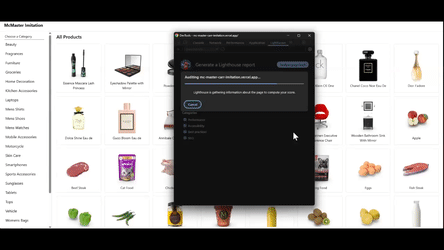
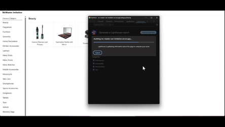
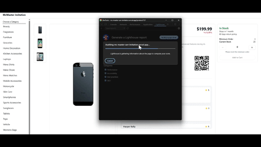
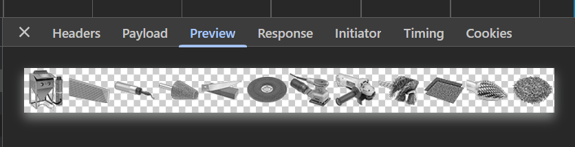

# 🏁Imitate The Fastest Website In The World

If you've ever searched for or come across discussions about website performance, [McMaster-Carr](https://www.mcmaster.com/) is almost always referred to as the fastest website in the world. Since the site is genuinely that fast, I wanted to recreate it using the latest modern technologies available as of 2025, with Next.js as the foundation.

## Goals

The goal of this project is to closely mimic its simplicity, speed, and efficiency and not to focus on animations, aesthetics, or other visual enhancements.

[Lighthouse](https://developer.chrome.com/docs/lighthouse/overview) are used to determine the website performance.

## Tech Stack

- [Next JS](https://nextjs.org/docs) [App router]
- [TailwindCSS](https://tailwindcss.com/)
- [Shadcn](https://ui.shadcn.com/)
- [Tanstack Query](https://tanstack.com/query/latest/docs/framework/react/overview)
- [React Virtuoso](https://virtuoso.dev/)

## API Reference

This project use open source dummy API from [dummyjson](https://dummyjson.com/) as the server mock feeding the content for client to see

## Demo

McMaster-Carr imitation web [demo link](https://mc-master-carr-imitation.vercel.app/)🌐

## Key Features

- Infinite scroll product list with virtualization
- Server components and Client components combo
- SEO-optimized with dynamic metadata
- Server-side and client-side data caching
- Responsive layout using TailwindCSS
- ISR (Incremental Static Regeneration)

With the correct implementation I succeed to achieve 100 points performance on Lighthouse Chrome browser for all the 3 main pages:







## ⚠️ Disclaimer

Please note that Lighthouse scores and performance results may vary depending on your:

- Device performance (CPU, RAM, etc.)
- Network connection (Wi-Fi, 4G, etc.)
- Background activity (apps, browser tabs, etc.)

> For the most accurate results, I highly recommend testing the site in an Incognito window with no browser extensions enabled.
> Some browser extensions can significantly affect Lighthouse metrics by injecting scripts or delaying page load.

## Architectural Decisions

We are going to see on some interesting things on how the McMaster-Carr original
website works and try to implement that in Next JS wheter using the same way or another way. There is some point on how website can run fast other than obvious things like internet connection and device/engine specifications, which are:

## 1. Website Type – SPA vs. Traditional

When navigating the McMaster-Carr site, you’ll notice there’s no full-page reload. That’s because it uses a Single Page Application (SPA) model, where routing is handled client-side via JavaScript. Frameworks like React and Vue make this possible.

However, Next.js is not a pure SPA. It supports both client-side and server-side rendering, enabling better SEO while maintaining a fast user experience.

> In this imitation project, we use Next.js App Router, combining Server Components and Client Components to mimic McMaster-Carr's speed and interactivity.

Next.js supports:

- Server Components (SSR/SSG/ISR)
- Client Components (CSR)
- Dynamic Routing
- Metadata generation

## 2. Server-Side Rendering (SSR)

SSR renders HTML on the server before sending it to the client. In Next.js, this is ideal for pages that don’t need immediate interactivity (i.e., no event listeners or hooks).

SSR is used for pages that benefit from server-side data fetching and SEO, like product pages. Example:

```ts
// Example of SSR using Server Component
export default async function ProductPage({ params }: PageParams) {
  const { id } = await params;
  const product = await getProductById(id);

  if (!product) return notFound();

  return <ProductPageContent product={product} />;
}
```

Here, we fetches product data, then passes it to ProductPage (Client Component) for rendering and user interaction.

> Server Component can have Client Component as its children, but Client Component cannot have Server Component as its children

## 3. Client Side Rendering (CSR)

CSR renders the UI directly in the browser and allows full access to the DOM, making it suitable for interactive pages.

In Next.js, you enable CSR by adding "use client" at the top of your component file. You’ll often use React hooks (useEffect, useState, etc.) here, especially when fetching data dynamically.

```ts
// "use client" declares this as a Client Component
"use client";
```

This setup allows React hooks like `useState` and `useEffect`

In this example I use CSR in mainly every page since it has a mandatory user interaction which mainly clicking (Link).

## 4. Inline Styling for Faster Paint

For critical above-the-fold content (e.g. product title, price, image), inline styling is used intentionally.

This is based on how browsers prioritize style calculation:

Inline styles are parsed and applied immediately during HTML parsing.

External or class-based styles must wait for CSS construction.

While the difference is often minimal, for content that renders in the first viewport (especially in SSR scenarios), inline styles can slightly improve first paint and LCP (Largest Contentful Paint) performance.

Important: This technique is used sparingly and only where performance gain is measurable. Tailwind utility classes are still preferred for most styling.

## 5. Data Caching

Efficient data fetching and caching are key to performance, especially if its a heavy data. If its a data that changes rapidly then it is better to changes frequently, but for data that are not changes often we can use the same data that already fetched.

### - SSR Caching (with revalidate)

Next.js lets you cache server-rendered data using the `revalidate` option.

Some data — such as real-time or rapidly changing content — must always be fresh. For that case, we use cache: "no-store" to disable SSR caching entirely.

```ts
// getProductById.ts
export const getProductById = async (
  id: Product["id"]
): Promise<Product | null> => {
  const res = await fetch(`${config.BASE_URL}/products/${id}`, {
    cache: "no-store", // SSR
  });
  const product: Product = await res.json();

  return product ?? null;
};
```

This guarantees that every product detail page always shows the most up-to-date data (e.g. price, stock).

Advanced way on how the big e-commerce website works are make the product detail page have a bunch of different API, so like for the product detail endpoints we can set it for 1 hour, but for the price and stock endpoints we can set it much faster maybe like 1 to 5 minutes.

### - CSR Caching (with TanStack Query)

CSR caching helps avoid redundant network requests for rarely-changing data.

For client-side caching, I use TanStack Query (React Query) to make things easier.

```ts
export const useCategories = () => {
  return useQuery({
    queryKey: [CATEGORY_QUERY_KEY.CATEGORY],
    queryFn: async () => {
      const res = await fetch(`${config.BASE_URL}/products/categories`);
      const categories: Category[] = await res.json();
      return categories;
    },
    staleTime: 24 * 60 * 60 * 1000, // 24 hours
    gcTime: 24 * 60 * 60 * 1000, // 24 hours
  });
};
```

Here, category data is considered fresh for 24 hours. This avoids redundant API calls for rarely updated content.

## 6. ISR (Incremental Static Regeneration)

Incremental Static Regeneration (ISR) allows you to statically pre-render pages at build time and update them in the background on a time-based schedule — all without needing to rebuild the entire app.

This gives you the performance benefits of static generation while keeping your content reasonably fresh.

### - Pre-render dynamic routes with generateStaticParams()

```ts
export async function generateStaticParams() {
  const categories = await getCategories();
  return categories.map(({ slug }) => ({ slug }));
}
```

This ensures all category pages are statically generated ahead of time for fast first loads.

### - Regenerate the page every 10 minutes (revalidate: 600)

When a user visits a category page, the cached static version will be served instantly. Then, after 600 seconds (10 minutes), the next request will trigger a background regeneration to fetch the latest data:

```ts
const products = await getProductsByCategory(slug, {
  next: {
    revalidate: 600, // revalidate every 10 minutes
  },
});
```

This is ideal for category pages where products may be added/removed throughout the day, but real-time accuracy isn’t critical.

Note:
Use revalidate wisely — don’t set it too low for content that doesn’t change often.

## 7. Image Optimization

Images are crucial for UX but can hurt performance if unoptimized.

Images are optimized using Next.js `<Image />` component:

- Lazy loading by default
- Automatic sizing with sizes and fill
- WebP served where supported

```ts
{
  product?.images?.map((src, i) => (
    <Button
      key={i}
      variant={"ghost"}
      className="relative border w-[80px] h-[60px] 2xl:w-[90px] 2xl:h-[90px]"
      onClick={() => {
        setSelectedImageIndex(i);
      }}
      aria-label={i.toString()}
    >
      <Image
        src={src}
        alt={`${product?.title}-${i}`}
        fill
        sizes="(min-width: 1536px) 110px, 90px"
        className="p-[4px] 2xl:p-[8px]"
        style={{
          objectFit: "contain",
          userSelect: "none",
        }}
        draggable={false}
        quality={10}
      />
    </Button>
  ));
}
```

WebP is preferred over jpg, jpeg, or png due to better compression and quality. With Next.js, you don’t need to manually convert formats.

Note: For important images such as Hero section you should use:

```ts
loading="eager"
// and or without
priority={true}
```

This tells Next.js to load the image as soon as possible because we want the Image served as soon as possible for user.

## Insteresting Facts



The original McMaster-Carr website on product by category page, they use a single image for the products

This is somehow genius because you just fetch one image and make this into a separate images. But the are downsides whereas its not a common method and this is going to be a challenging thing to do for someone new that wants to make changes to the code

## 8. Virtualization (Infinite Scroll)

To handle large datasets efficiently, the product list is virtualized using react-virtuoso. Only the visible items in the viewport are rendered.

In this example I use `react-virtuoso` open source library for virtualization. Tanstack is also published a library for virtualization recently, you can see their documentation on [Tanstack Virtual](https://tanstack.com/virtual/latest/docs/introduction)

```tsx
// This is the component that implements virtualization
<VirtuosoGrid
  data={products}
  endReached={() => {
    if (hasNextPage && !isFetchingNextPage) {
      fetchNextPage();
    }
  }}
  className="hide-scrollbar"
  listClassName="grid grid-cols-2 md:grid-cols-4 lg:grid-cols-6 xl:grid-cols-8 gap-4"
  increaseViewportBy={{
    bottom: 1000,
    top: 1000,
  }}
  components={{
    Footer: () =>
      isFetchingNextPage ? (
        <Label className="p-4 text-center text-muted-foreground text-sm">
          Loading more...
        </Label>
      ) : null,
  }}
  itemContent={(i, product) => (
    <Link key={product.id} href={`/product/${product.id}`}>
      <ProductItemCard
        {...product}
        loading={i <= MIN_IMAGE_TO_EAGER_LOADING ? "eager" : "lazy"}
        fetchPriority={i <= MIN_IMAGE_TO_EAGER_LOADING ? "high" : "auto"}
      />
    </Link>
  )}
/>
```

Paired with useInfiniteQuery() from TanStack Query for paginated fetching:

```ts
export const useInfiniteProducts = () => {
  return useInfiniteQuery<PaginatedProducts, Error>({
    queryKey: [`${PRODUCTS_QUERY_KEY.PRODUCTS}-infinite`],
    queryFn: ({ pageParam = 0 }) =>
      getPaginatedProducts({
        pageParam: pageParam as number,
        pageSize: PAGE_SIZE,
      }),
    getNextPageParam: (lastPage) => {
      const nextSkip = lastPage.skip + lastPage.limit;
      return nextSkip < lastPage.total ? nextSkip : undefined;
    },
    staleTime: 1000 * 60 * 60, // 1 hour
    gcTime: 1000 * 60 * 60, // 1 hour
    placeholderData: {
      pages: [],
      pageParams: [0],
    },
    initialPageParam: 0,
    retry: 0,
  });
};
```

This setup loads new data only when needed and keeps recently viewed data cached for smoother navigation.

## 5. SEO (Search Engine Optimization) Strategy

A well-optimized website should be both accessible to users and readable by search engines. Common SEO Strategy are:

- Uses semantic HTML elements (article, section, main, h1, etc.)
- Implements dynamic metadata per page using generateMetadata()
- Proper alt, aria-label, and meaningful headings
- Proper Metadata

Next.js makes it easy to add both static and dynamic metadata for SEO:

```ts
// Export the static metadata
export const metadata: Metadata = {
  title: "All products",
  description: "all product from each of categories",
};

// Generate a dynamic metadata
export async function generateMetadata({
  params,
}: PageParams): Promise<Metadata> {
  const { id } = await params;
  const product = await getProductById(id);

  return {
    title: product?.title ?? "Product not found",
    description:
      product?.description ??
      "The product you are looking for could not be found.",
  };
}
```

Metadata improves how search engines understand and index each page.

# Summary

This project aims to replicate the performance and simplicity of McMaster-Carr using Next.js focusing on:

- ✅ Fast navigation using App Router (SPA-like behavior)
- ✅ Mixed rendering: SSR, CSR, and ISR
- ✅ Fine-grained caching strategies (server & client)
- ✅ Focused image and content optimization
- ✅ SEO-conscious development
- ✅ Virtualized UI for scaling to large datasets
